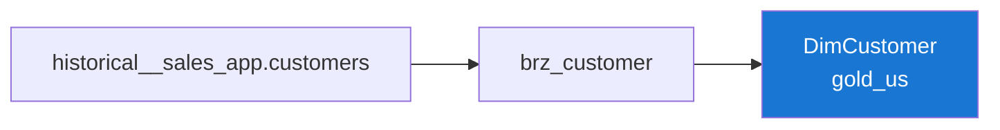

---
hide:
  - toc
tags:
  - catalog
  - dimension
  - customer
---

# DimCustomer

Gold Layer
Dimension
SCD2

> Dimension of customers who place sales orders.

## Overview

=== "Business"

    **What it is**: Registry of customers, with location and business segment.

    **Purpose**: Segment sales analyses by customer attributes.

    **Used by**: The Sales explore and any customer-level reporting.

=== "Technical"

    | Property | Value |
    |---|---|
    | **Table** | `gold_us.DimCustomer` |
    | **Type** | `table` |
    | **Pattern** | SCD Type 2 |
    | **Granularity** | 1 row per customer version |
    | **Source** | `silver_us.dynamic__DimCustomer` |
    | **LookML View** | `dim_customer` |

## Column Schema

| Column | Type | Description | PK/FK | Source Table | Source Field |
|---|---|---|---|---|---|
| `sk_customer` | INT64 | SCD2 surrogate key (version). | **PK** | *(generated)* | — |
| `customer_id` | INT | Natural key of the customer. | NK | `sales_app.customers` | `id` |
| `customer_name` | STRING | Full name of the customer. |  | `sales_app.customers` | `full_name` |
| `email` | STRING | Email address. |  | `sales_app.customers` | `email` |
| `city` | STRING | City of address. |  | `sales_app.customers` | `city` |
| `state` | STRING | State / province. |  | `sales_app.customers` | `state` |
| `country` | STRING | Country. |  | `sales_app.customers` | `country` |
| `customer_segment` | STRING | Business segment (Consumer / Corporate / Home Office). |  | `sales_app.customers` | `segment` |
| `created_at` | TIMESTAMP | Original creation datetime. |  | `sales_app.customers` | `created_at` |
| `valid_from` | TIMESTAMP | Version validity start (SCD2). |  | *(CDC)* | — |
| `valid_to` | TIMESTAMP | Version validity end (SCD2). |  | *(CDC)* | — |
| `is_valid` | BOOL | TRUE for the current version. |  | *(CDC)* | — |

## Explore Joins

| Explore | Condition |
|---|---|
| `fact_sales` | `fk_customer = sk_customer` |

## Data Lineage

