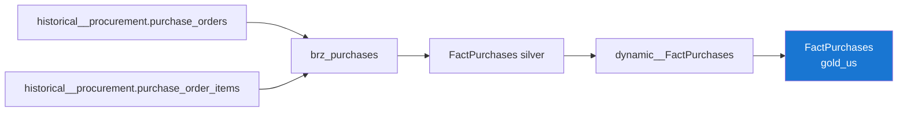

---
hide:
  - toc
tags:
  - catalog
  - fact
  - purchases
---

# FactPurchases

Gold Layer
Fact
Incremental

> Purchase order lines — the core procurement fact.

## Overview

=== "Business"

    **What it is**: One row per purchase order line, with quantity ordered, unit cost and total cost.

    **Purpose**: Procurement spend and supplier analysis by product, store and time.

=== "Technical"

    | Property | Value |
    |---|---|
    | **Table** | `gold_us.FactPurchases` |
    | **Type** | `incremental` (uniqueKey `sk_purchase`) |
    | **Granularity** | 1 row per purchase order line version |
    | **Source** | `silver_us.dynamic__FactPurchases` |
    | **Partition** | `DATE(order_date)` |
    | **Cluster** | `fk_supplier`, `fk_product` |
    | **LookML View** | `fact_purchases` |

## Column Schema

| Column | Type | Description | PK/FK |
|---|---|---|---|
| `sk_purchase` | INT64 | SCD2 surrogate key (version). | **PK** |
| `fk_supplier` | INT64 | Key to `DimSupplier` as of the order date. | FK |
| `fk_product` | INT64 | Key to `DimProduct` as of the order date. | FK |
| `fk_store` | INT64 | Key to `DimStore` as of the order date. | FK |
| `fk_date_order` | INT64 | Key to `DimCalendar` (order date, YYYYMMDD). | FK |
| `purchase_order_id` | INT | PO header identifier. |  |
| `purchase_order_item_id` | INT | Natural key of the PO line. | NK |
| `order_date` | DATETIME | Date the PO was placed. |  |
| `purchase_status` | STRING | PO status (Open / Received / Cancelled). |  |
| `quantity_ordered` | INT | Units ordered on this line. |  |
| `unit_cost` | NUMERIC | Cost per unit. |  |
| `total_cost` | NUMERIC | `quantity_ordered * unit_cost`. |  |
| `valid_from` / `valid_to` / `is_valid` | — | SCD2 validity columns. |  |

## Explore Joins

| Dimension | Condition |
|---|---|
| `dim_supplier` | `fk_supplier = sk_supplier` |
| `dim_product` | `fk_product = sk_product` |
| `dim_store` | `fk_store = sk_store` |
| `dim_calendar` | `fk_date_order = sk_date` |

## Data Lineage

