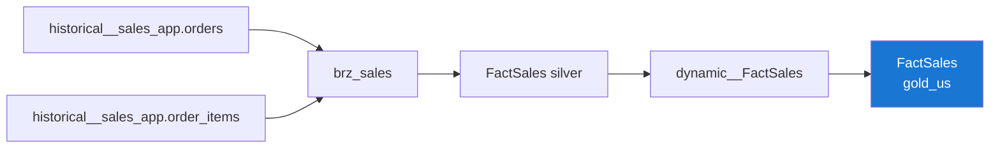

---
hide:
  - toc
tags:
  - catalog
  - fact
  - sales
---

# FactSales

Gold Layer
Fact
Incremental

> Sales order lines — the core revenue fact.

## Overview

=== "Business"

    **What it is**: One row per sales order line, with quantity, price, discount and net revenue.

    **Purpose**: Revenue, discount, units and margin analysis by product, store, customer and time.

    **Grain warning**: SUM measures are safe at the line grain. Joining to a one-to-many
    dimension is not a concern here (all joins are many-to-one).

=== "Technical"

    | Property | Value |
    |---|---|
    | **Table** | `gold_us.FactSales` |
    | **Type** | `incremental` (uniqueKey `sk_sales`) |
    | **Granularity** | 1 row per sales order line version |
    | **Source** | `silver_us.dynamic__FactSales` |
    | **Partition** | `DATE(order_date)` |
    | **Cluster** | `fk_customer`, `fk_product` |
    | **LookML View** | `fact_sales` |

## Column Schema

| Column | Type | Description | PK/FK |
|---|---|---|---|
| `sk_sales` | INT64 | SCD2 surrogate key (version). | **PK** |
| `fk_customer` | INT64 | Key to `DimCustomer` as of the order date. | FK |
| `fk_product` | INT64 | Key to `DimProduct` as of the order date. | FK |
| `fk_store` | INT64 | Key to `DimStore` as of the order date. | FK |
| `fk_date_order` | INT64 | Key to `DimCalendar` (order date, YYYYMMDD). | FK |
| `order_id` | INT | Order header identifier. |  |
| `order_item_id` | INT | Natural key of the order line. | NK |
| `order_date` | DATETIME | Date the order was placed. |  |
| `order_status` | STRING | Order status (Shipped / Delivered / Returned / Cancelled). |  |
| `quantity` | INT | Units sold on this line. |  |
| `unit_price` | NUMERIC | Selling price per unit. |  |
| `discount_amount` | NUMERIC | Total discount applied to the line. |  |
| `gross_amount` | NUMERIC | `quantity * unit_price`. |  |
| `net_amount` | NUMERIC | `gross_amount - discount_amount`. |  |
| `valid_from` / `valid_to` / `is_valid` | — | SCD2 validity columns. |  |

## Explore Joins

| Dimension | Condition |
|---|---|
| `dim_customer` | `fk_customer = sk_customer` |
| `dim_product` | `fk_product = sk_product` |
| `dim_store` | `fk_store = sk_store` |
| `dim_calendar` | `fk_date_order = sk_date` |

## Data Lineage

