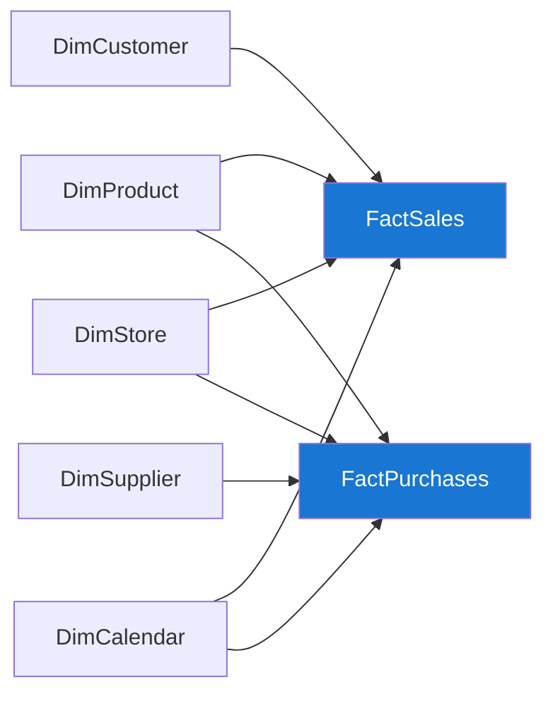

# Data Governance Portal

Welcome to the documentation portal for the **Data Warehouse Template** — a
domain-agnostic dimensional model built with Dataform on BigQuery, following a
Medallion Architecture (Bronze → Silver → Gold) and consumed by Looker.

!!! info "Template repository"
    This portal documents **fictional, generic business data** (Sales, Purchases,
    Customers, Products, Stores, Suppliers). Replace the sample entities with your own.

## Star Schema

## Layers

| Layer | Schema | Purpose |
|---|---|---|
| Bronze | `bronze_us` | Temporal joins, CDC filtering, renaming |
| Silver | `silver_us` | Business naming + SCD Type 2 |
| Gold | `gold_us` | Star schema (facts + dimensions) |

## Navigation

- **Data Catalog** — one page per fact and dimension, with column schema, joins and lineage.
